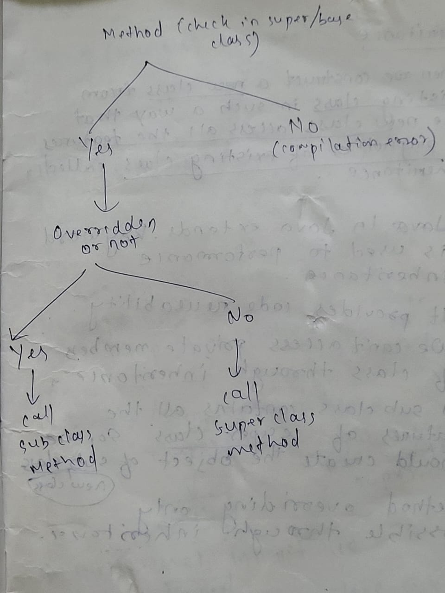

# Programming Structures

In programming languages there are basically two approaches : 
  -  POPs (Procedural Oriented Programming Structure)
  -  OOPs (Object Oriented Programming Structure)

## OOPs (Object Oriented Programming Structure)

OOPs stands on 4 pillars :
>- Polymorphism
>- Inheritance
>- Encapsulation
>- Data Abstraction

### 1. Polymorphism
**Poly means many and morphism means form** 
Same object having different behaivours.

**There are 2 types of Polymorphism:-** 
i. Compile time polymorphism 
ii. Runtime polymorphism

#### i. Compile Time Polymorphism
A polymorphism which exists at the time of compilation is called Compile Time Polymorphism

**Ex: Method Overloading**
- When a class contains more than one method with same name and different types and different number of parameters.
  -     int pol(int a)
  -     int pol(int a,int b)

#### ii. Runtime Polymorphism
A polymorphism which exists at the time of execution of program is called Runtime Polymorphism

**Ex: Method Overriding**
- Whenever we are writing method in the **super(base) and sub(derived)** class in such a way that the method name and parameter must be same called method overriding.
- It uses **extends** keyword in **derived** class.
- We can't perform method overriding without using **Inheritance.**
  -     class A{
            void show()
            {
              -----
              -----
            }
        }
        class B extends A{
            void show()
            {
              -----
              -----
            }
        }

### 2. Inheritance
When we create a new class from existing class in such a way that the new class access all the features and properties of existing class called Inheritance.
- In java **extends** keyword is used to perform inheritance.
- It provides code reusability
- We can't access private members of class through inheritance.
- A subclass contains ll the features of super class. Therefore we should create the object of sub class(new class)
- **Method Overriding** only possible through inheritance.
  -     class A{                               // Base/Super class
            void show()
            {
              -----
              -----
            }
        }
        class B extends A{                     // Derived/Sub class
            void show()
            {
              -----
              -----
            }
        }
- **Object hamesha sub class ke banane chahiye, kyuki subclass mein saare properties hote h super class ke.**

### 3. Encapsulation
Encapsulation is a mechanism through which we can wrap the data members and member methods of class in a single unit is called Encapsulation.

 Note :-
- Declare the class variable as a private
- Declare the class methods as a public
  -     class A
        {
            private int value;                  // Data hiding
            public void setValue(int x)         // Data abstraction
            {
                value = x;
            }
            public int getValue()
            {
                return value;
            }
        }
        class B
        {
            public static void main(String args[])
            {
                A obj = new A();
                obj.setValue(100);
                System.out.println(obj.getValue());
            }
        }
### 4. Abstraction
Data Abstraction is a process of hiding the implementation details from the user. Only the highlighted set of services are provided to the user. 

**Advantages :**
>- Security
>- Enhancement

**Abstraction level :**
>- Abstract class -> 20%
>- Interface -> 100%

#### Abstract Class
The class which contains the abstract keyword in its declaration is called abstract class. 

- We can't reate object for abstract class.
- It may or may not contain abstract methods.
- To use an abstract class, you have to inherit it from subclass.
- If a class contgain partial implementation then we should declare a class as abstract.

  - Here when the method is abstract, the class will be abstract
  -     abstract class A
        {
            abstract void m1()         
            {
                -----
                -----
            }
        }
    
  - Here when the method is not abstract then we can make the class as abstract if we want.
  -     class A
        {
            public void m1()
            {
                -----
                -----
            }
        }

**Q) Why we don't make object of abstract class?**
- Because we gonna access/use the methods of abstract class from different classses.
  -     abstract class animal
        {
            public abstract void eat()
        }
        class dog extends animal
        {
            -----
            -----
        }
        class tiger extends animal
        {
            -----
            -----
        }
